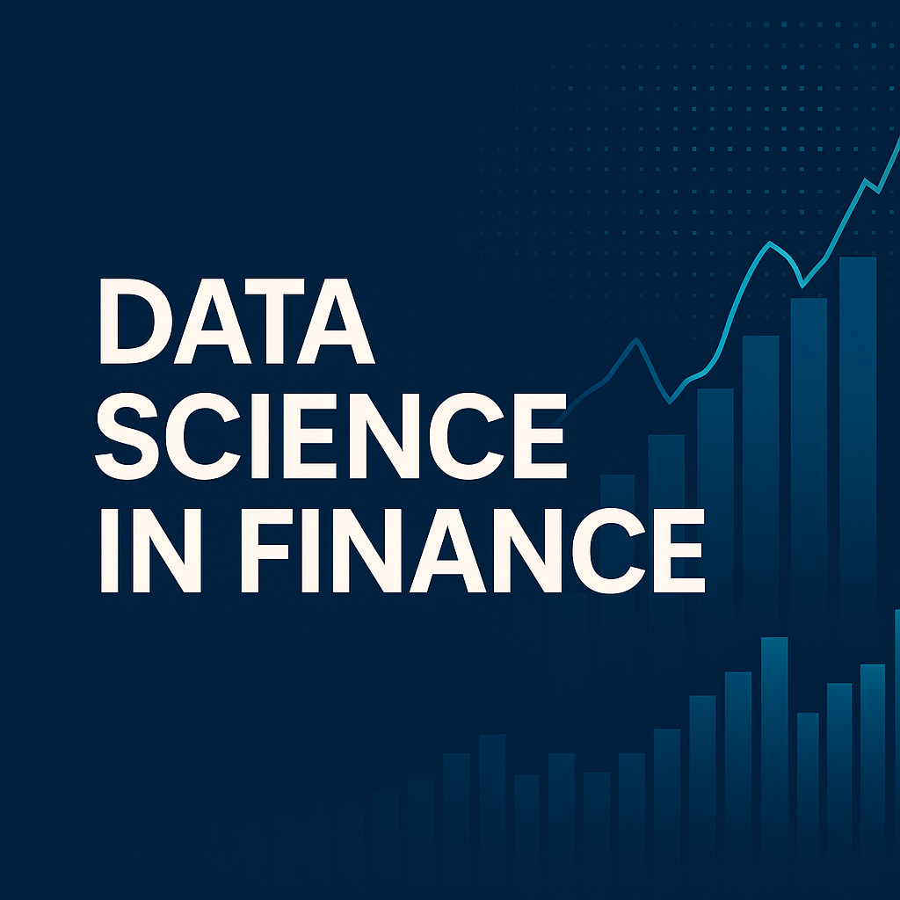
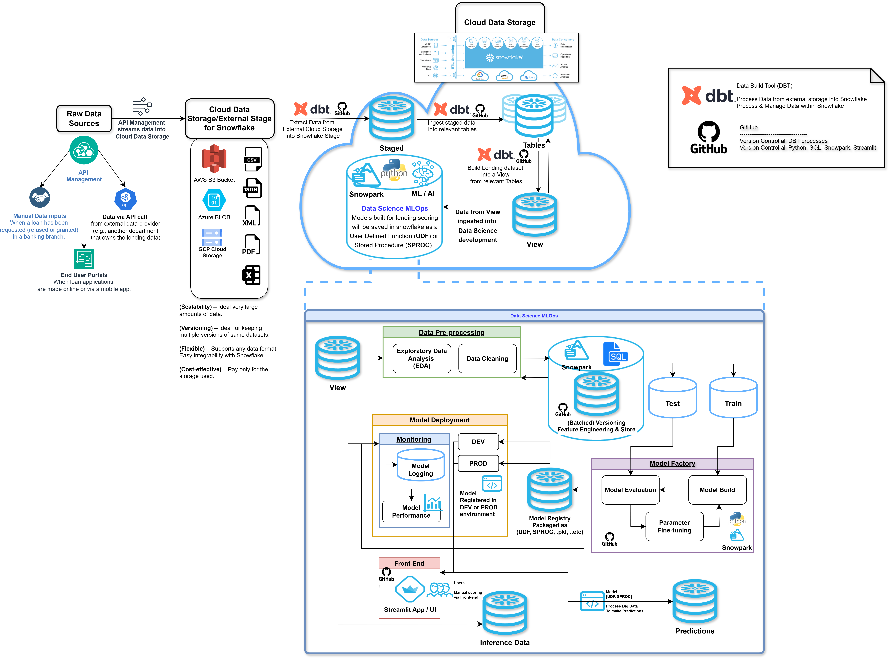

# Data Science Finance

Repository containing my work done for the [ELVTR](https://uk.elvtr.com/course/data-science-in-finance) course "Data Science in Finance"

Work Consists of utilising advanced analytics, Machine Learning, Deep Learning for Risk Assessment, Forecasting, and Time-Series analysis in finance. Also building real-time scoring application using a predictive ML model for classifying loan applications.

---

1\. Using Lending-Club datasets, exploring relationships between attributes of customer profiles and building both ML & DL models to predict loan defaults.
---
### [Data Exploration](notebooks/assignment1_data_cleaning_and_eda.ipynb)
### [Machine-Learning Modelling for Loan Default](notebooks/assignment2_build_baseline_ml_model.ipynb)
### [Deep-Learning Modelling for Loan Default](notebooks/assignment3_DL_challenger_model.ipynb)

2\. Customer segmentation using credit card data for targeted marketing and customer management.
---
### [Customer Credit Card Segmentation](notebooks/assignment4_customer_segmentation.ipynb)
  
3\. Time-Series Forecasting on Stock Data using Traditional Algorithms & Deep Learning.
---
### [Time-Series Forecasting](notebooks/assignment5_timeseries_forecasting.ipynb)

4\. Final Project - Building real-time loan scoring application via Streamlit with FastAPI back-End.
---
### [Real-Time Loan Scoring Application](capstone_project)

5\. Data Architecture of Lending Club Scoring System

